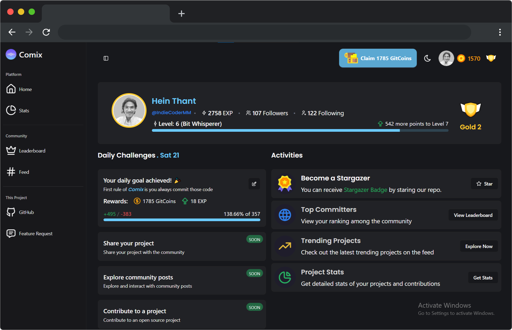

<div align="center">
  
</div>

<div align="center">
  <a href="https://comix-dev.vercel.app">Home Page</a> |
  <a href="https://www.linkedin.com/in/hthantoo/">LinkedIn</a> |
  <a href="https://bsky.app/profile/heinthantoo.bsky.social">BlueSky</a>
</div>

---

<div align="center"><strong>Gamify your GitHub journey!</strong><br>
Track your commits, compete globally, and make coding more fun and rewarding with Comix.
</div>

---

## What is Comix?

**Comix** is a gamified platform designed to make tracking your GitHub commits fun and engaging.
With Comix, you can:

- Set daily commit goals.
- Earn _GitCoins_ and experience points for completing your goals.
- Compete on a global leaderboard and climb ranking tiers.
- Share your repositories and boost them to gain visibility.
- Access a real-time stats dashboard showing your GitHub contributions.

## Live Website

Check out **Comix** live! Visit the platform to start tracking your GitHub commits and join the global leaderboard:

<a href="https://comix-dev.vercel.app">https://comix-dev.vercel.app</a>

> [!NOTE]
> Comix is an early-stage product, and we welcome any feedback to help us improve the platform.
> Feel free to share your suggestions or ideas with us!

## Key Features

- 🎯**Daily Goals:** Stay consistent with your coding habits by setting and completing daily commit goals.
- ⚡**Coins & EXP:** Make progress more exciting by earning rewards.
- 👑**Global Leaderboard:** See how you rank among developers worldwide.
- 🚀**Boost Repositories:** Use your coins to promote your projects and gain visibility.
- 📊**Real-Time Stats Dashboard:** Get detailed insights into your GitHub contributions.

<div align="center">
  
</div>

## Use Case

- **For Developers:** Comix helps you maintain consistency in coding while enjoying a gamified experience.
- **For Project Owners:** Gain visibility for your repositories by boosting them in the Comix platform.

## Tech Stack

- **Frontend:** Next.js, Tailwind CSS, ShadCN
- **Backend:** tRPC, Apollo, Redis
- **Database:** PostgreSQL, Drizzle ORM, Supabase
- **Hosting:** Vercel
- **Validation:** Zod

## Getting Started

### GitHub OAuth Setup

To run Comix, you need to create a GitHub OAuth app and retrieve the client ID and secret. Follow these steps:

1. **Create a GitHub OAuth App:**

   - Visit the [GitHub Developer Settings](https://github.com/settings/developers).
   - Click on **"New OAuth App"** under the "OAuth Apps" section.

2. **Fill Out Application Details:**

   - **Application Name:** Enter a name (e.g., "Comix").
   - **Homepage URL:** Use your platform's URL (e.g., `https://Comix.example.com`).
   - **Authorization Callback URL:** Use the callback endpoint (e.g., `https://comix.example.com/api/auth/callback`).

3. **Save and Copy Secrets:**

   - Copy the **Client ID** and **Client Secret** from the app's settings.

### Environment Variables

Create a `.env.local` file in the root directory and add the following environment variables:

```sh
# GitHub OAuth
GITHUB_SECRET=
GITHUB_ID=

# Random Secret
NEXTAUTH_SECRET=

# Postgres url
DB_URL=

# Redis
REDIS_URL=

# GitHub GraphQL AP
NEXT_PUBLIC_GITHUB_GQL_API=https://api.github.com/graphql
```

### Installation

1. **Install Dependencies:**

   ```sh
   npm install --legacy-peer-deps
   ```

2. **Set Up Database:**

   ```sh
   npm run db:generate
   npm run db:migrate
   ```

3. **Run Development Server:**

   ```sh
   npm run dev
   ```

4. **Build for Production:**

   ```sh
   npm build
   ```

## Project Structure

<details>
<summary>Click to expand</summary>

```
.
└── ./
    ├── app/
    ├── components/
    ├── db/
    │   ├── drizzle/
    │   └── db.ts
    ├── features/
    │   ├── dashboard/
    │   └── landing/
    ├── hooks/
    ├── lib/
    │   ├── redis.ts
    │   └── apollo.ts
    ├── server/
    │   └── trpc/
    │       ├── routers/
    │       └── trpc.ts
    ├── services/ # DB & API services
    │   ├── users/
    │   ├── github/
    │   └── leaderboard/
    ├── styles/
    ├── types/
    ├── utils/
    │   ├── auth.ts # Auth provider & session
    │   └── trpc.ts # trpc client
    └── middleware.ts
```

</details>

### Roadmap

- [ ] **User Profiles:** Allow users to create profiles and share
- [ ] **Streaks:** Track and reward users for maintaining commit streaks
- [ ] **Achievements:** Unlock badges and achievements for completing milestones
- [ ] **More Challenges:** Introduce more coding challenges and competitions
- [ ] **Custom Challenges:** Allow users to create and share custom challenges
- [ ] **Bounty Issues:** Solve issues and earn rewards from the community

## Contribution

Comix is open-source and we welcome contributions! Check out the repository and feel free to create pull requests or raise issues.

## License

This project is licensed under the [MIT License](./LICENSE).

---

<div align="center">
  <strong>Ready to level up your coding?</strong><br>
  Login with GitHub and start your Comix journey today!
</div>
